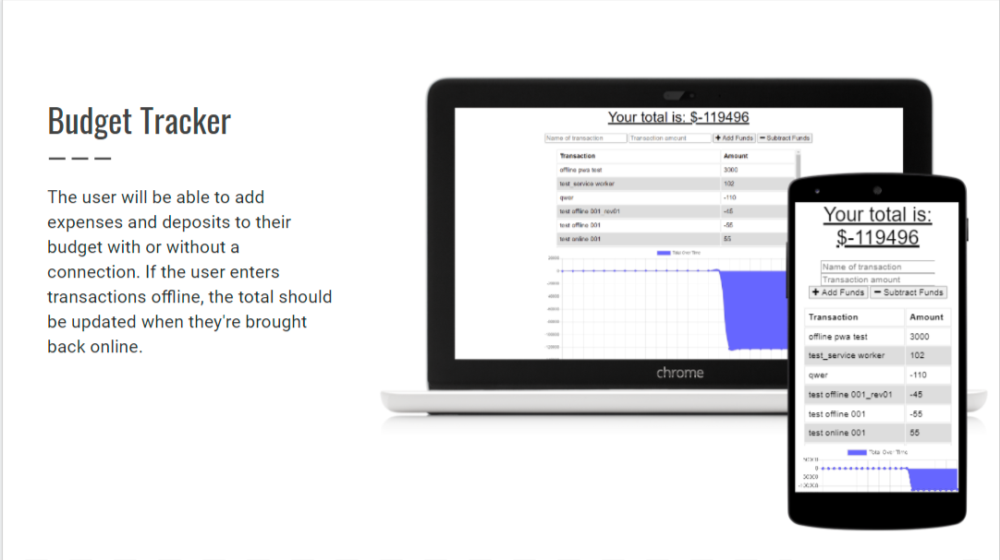

# Budget Tracker Starter Code

## Description

he user will be able to add expenses and deposits to their budget with or without a connection.

## Table of Contents

- [Contribution](#contribution)
- [Screenshot](#screenshot)
- [License](#license)
- [Badges](#badges)
- [GitHub](#github)
- [Heroku](#heroku)

## Screenshot

## Contribution

Made with ❤️ by Ruohan Wang

## License

ISC

## Badges

## GitHub

My GitHub link: (https://github.com/rhw-git/budget-tracker)

## Heroku

My Heroku link: (https://still-waters-21923.herokuapp.com/ )
